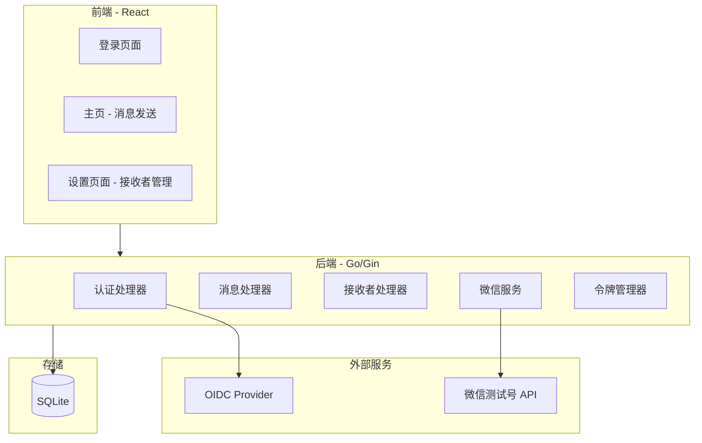

# 设计文档

## 概述

微信测试号消息通知系统采用前后端分离架构：
- **前端**: React + TypeScript + Vite
- **后端**: Go + Gin 框架
- **数据库**: SQLite
- **认证**: OIDC (OpenID Connect)

## 架构



## 组件和接口

### 前端组件

```
src/
├── components/
│   ├── Layout.tsx           # 布局组件（导航栏）
│   ├── RecipientCheckbox.tsx # 接收者复选框
│   └── MessageForm.tsx      # 消息表单
├── pages/
│   ├── Login.tsx            # 登录页面
│   ├── Home.tsx             # 主页（消息发送）
│   └── Settings.tsx         # 设置页面（接收者管理）
├── services/
│   ├── api.ts               # API 客户端
│   └── auth.ts              # 认证服务
└── types/
    └── index.ts             # 类型定义
```

### 后端 API 接口

| 方法 | 路径 | 描述 |
|------|------|------|
| GET | /auth/login | 重定向到 OIDC 登录 |
| GET | /auth/callback | OIDC 回调处理 |
| POST | /auth/logout | 登出 |
| GET | /api/recipients | 获取所有接收者 |
| POST | /api/recipients | 添加接收者 |
| PUT | /api/recipients/:id | 更新接收者 |
| DELETE | /api/recipients/:id | 删除接收者 |
| POST | /api/messages/send | 发送消息 |

### 后端结构

```
backend/
├── main.go
├── config/
│   └── config.go            # 配置管理
├── handlers/
│   ├── auth.go              # 认证处理器
│   ├── recipient.go         # 接收者处理器
│   └── message.go           # 消息处理器
├── models/
│   └── models.go            # 数据模型
├── services/
│   ├── wechat.go            # 微信 API 服务
│   └── token.go             # 令牌管理
├── repository/
│   └── sqlite.go            # 数据库操作
└── middleware/
    └── auth.go              # 认证中间件
```

## 数据模型

### Recipient (接收者)

```go
type Recipient struct {
    ID        int64     `json:"id"`
    OpenID    string    `json:"openId"`
    Name      string    `json:"name"`
    CreatedAt time.Time `json:"createdAt"`
    UpdatedAt time.Time `json:"updatedAt"`
}
```

### SendMessageRequest (发送消息请求)

```go
type SendMessageRequest struct {
    Title        string  `json:"title"`
    Content      string  `json:"content"`
    RecipientIDs []int64 `json:"recipientIds"`
}
```

### WeChatTemplateMessage (微信模板消息)

```go
type WeChatTemplateMessage struct {
    ToUser     string                 `json:"touser"`
    TemplateID string                 `json:"template_id"`
    Data       map[string]interface{} `json:"data"`
}
```

### WeChatAPIResponse (微信 API 响应)

```go
type WeChatAPIResponse struct {
    ErrCode int    `json:"errcode"`
    ErrMsg  string `json:"errmsg"`
    MsgID   int64  `json:"msgid,omitempty"`
}
```

## 正确性属性

*属性是系统在所有有效执行中应保持为真的特征或行为——本质上是关于系统应该做什么的形式化陈述。属性作为人类可读规范和机器可验证正确性保证之间的桥梁。*

### 属性 1: 未认证访问重定向
*对于任意* 未携带有效会话的请求，访问受保护的 API 端点应返回 401 状态码或重定向到登录页面
**验证: 需求 1.1**

### 属性 2: 登出终止会话
*对于任意* 有效会话，执行登出操作后，使用相同会话令牌的后续请求应被拒绝
**验证: 需求 1.4**

### 属性 3: 消息发送到所有选定接收者
*对于任意* 有效的消息（非空标题和内容）和非空接收者列表，发送操作应向列表中的每个接收者发送消息
**验证: 需求 2.1, 4.2**

### 属性 4: 空接收者列表验证
*对于任意* 消息发送请求，如果接收者列表为空，系统应拒绝该请求并返回验证错误
**验证: 需求 2.2**

### 属性 5: 空白消息验证
*对于任意* 仅包含空白字符的标题或内容，系统应拒绝该消息并返回验证错误
**验证: 需求 2.3**

### 属性 6: 接收者列表完整性
*对于任意* 数据库中的接收者集合，获取接收者列表应返回所有接收者，不多不少
**验证: 需求 3.1**

### 属性 7: 接收者添加持久化
*对于任意* 有效的接收者数据（有效 OpenID 和名称），添加后查询应能获取到该接收者
**验证: 需求 3.2, 5.1**

### 属性 8: 重复 OpenID 拒绝
*对于任意* 已存在的 OpenID，尝试添加具有相同 OpenID 的接收者应被拒绝
**验证: 需求 3.3**

### 属性 9: 接收者删除
*对于任意* 存在的接收者，删除后查询应无法获取到该接收者
**验证: 需求 3.4**

### 属性 10: 接收者更新
*对于任意* 存在的接收者和新名称，更新后查询应返回新名称
**验证: 需求 3.5**

### 属性 11: 全选/取消全选
*对于任意* 接收者列表，全选操作后选中数量应等于总数，取消全选后选中数量应为 0
**验证: 需求 4.3, 4.4**

### 属性 12: 数据持久化往返
*对于任意* 接收者数据，保存到数据库后重新加载应得到等价的数据
**验证: 需求 5.2**

### 属性 13: 微信消息格式化
*对于任意* 消息标题和内容，格式化后的微信模板消息应包含所有必需字段且符合 API 规范
**验证: 需求 6.1**

### 属性 14: JSON 序列化往返
*对于任意* 有效的消息数据结构，序列化为 JSON 后再反序列化应得到等价的数据结构
**验证: 需求 6.3, 6.4**

### 属性 15: 令牌自动刷新
*对于任意* 过期的访问令牌，发送消息前系统应自动刷新令牌，确保使用有效令牌
**验证: 需求 6.2**

## 错误处理

### 前端错误处理
- API 请求失败时显示错误提示
- 表单验证错误实时显示
- 网络错误提供重试选项

### 后端错误处理
- 统一错误响应格式: `{"error": "错误信息", "code": "ERROR_CODE"}`
- 数据库错误记录日志并返回友好信息
- 微信 API 错误透传给前端

## 测试策略

### 单元测试
- 使用 Go 标准 `testing` 包测试后端逻辑
- 使用 Vitest 测试前端组件和服务
- 测试覆盖验证逻辑、数据转换、错误处理

### 属性测试
- 使用 `github.com/leanovate/gopter` 进行 Go 属性测试
- 每个属性测试运行至少 100 次迭代
- 每个属性测试必须注释引用设计文档中的正确性属性
- 格式: `// **Feature: wechat-notification, Property {number}: {property_text}**`

### 测试重点
- 消息验证逻辑（空白检测、接收者验证）
- 接收者 CRUD 操作
- JSON 序列化/反序列化往返
- 认证流程
